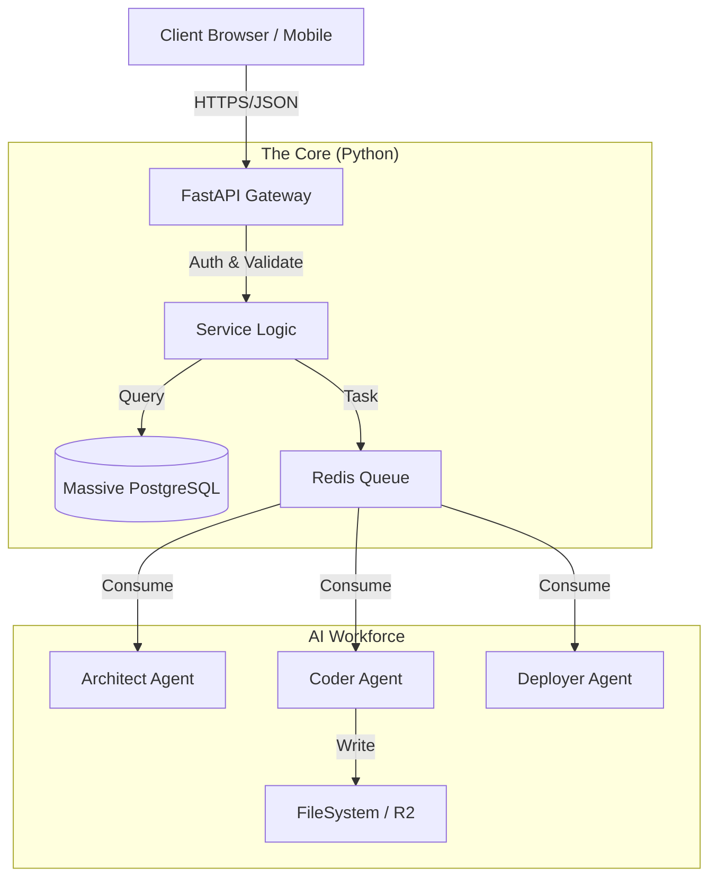

# 📘 المرجع الشامل للمطور: منصة التجارة بالبرمجيات
# The Comprehensive Developer Reference: Software Commerce Platform

هذا المستند هو المرجع الأساسي والحقيقة الواحدة (Source of Truth) لجميع المطورين العاملين على المشروع.

---

## 1. التعريف بالمشروع (Project Definition)
**النوع:** منصة تجارة برمجيات (Software Commerce Platform).
**الوصف:** نظام بيئي متكامل يسمح بإنشاء، بيع، إدارة، وتشغيل البرمجيات والمنتجات الرقمية باستخدام الذكاء الاصطناعي.
**النطاق:**
*   **🛒 التجارة (Commerce):** متجر متعدد البائعين (Multi-vendor Market).
*   **🏭 المصنع (Factory):** مولد تطبيقات (App Builder & SaaS Generator).
*   **🎨 الاستوديو (Studio):** أدوات تحرير وتوليد وسائط (AI Media Tools).
*   **⚙️ الإدارة (Management):** نظام ERP مصغر لإدارة العمليات والمبيعات.

---

## 2. جدول المهارات والتقنيات (Tech Stack & Skills Matrix)

هذا الجدول يوضح التقنيات المطلوبة والمهارات اللازمة لكل طبقة في النظام:

| الطبقة (Layer) | التقنية (Technology) | المهارات المطلوبة (Required Skills) | ملاحظات هامة |
| :--- | :--- | :--- | :--- |
| **الواجهة الأمامية** (Frontend) | **React 19 + Vite** TypeScript Tailwind CSS (Shadcn/UI) GSAP / Three.js | - إدارة الحالة المتقدمة (Zustand/TanStack Query) - تحسين الأداء (Memoization, Lazy Loading) - بناء واجهات ديناميكية (Server Driven UI) | الواجهة ضخمة جداً؛ يجب تقسيمها إلى موديولات (Micro-Frontends) منطقية داخل نفس الـ Repo. |
| **البوابة الخلفية** (API Gateway) | **FastAPI (Python)** | - Async programming - Pydantic Models - Authentication (OAuth2/JWT) - Rate Limiting | هذه هي النقطة الوحيدة التي تتحدث معها الواجهة الأمامية. ممنوع الاتصال المباشر بقاعدة البيانات. |
| **الذكاء والعمال** (AI & Workers) | **CrewAI + Python** LangChain Redis (Queue) | - Prompt Engineering - Agent Orchestration - Python Scripting - Docker Operations | العمال يعملون في الخلفية (Asynchronous). لا تنتظر الرد منهم مباشرة. |
| **قاعدة البيانات** (Data Layer) | **PostgreSQL** (Supabase) | - Database Design (Normalization) - SQL Optimization - JSONB fields (للبيانات المرنة) | قاعدة البيانات ستكون ضخمة. يجب تصميم الجداول بعناية فائقة (Indexes, FKs). |
| **البنية التحتية** (DevOps) | **Docker** Cloudflare GitHub Actions | - Containerization - CI/CD Pipelines - DNS & Networking | النظام يجب أن يكون قابلاً للنشر بضغطة زر (One-Click Deploy). |

---

## 3. هيكلية المشروع (Project Architecture)

النظام يتبع معمارية **Modular Monolith** مدعومة بـ **Event-Driven Architecture** للمهام الخلفية.

### المخطط العام:

---

## 4. تقسيم الأدوار (Roles & Permissions)

النظام يدعم تعدد الأدوار بصلاحيات دقيقة (RBAC):

1.  **المالك (Super Admin):** له تحكم كامل في المنصة، العمولات، الإعدادات، والموظفين.
2.  **الموظف (Staff):** (دعم فني، مبيعات، مراجع جودة) بصلاحيات محدودة حسب القسم.
3.  **البائع (Vendor):** له متجر خاص، لوحة تحكم بالمنتجات، ومحفظة مالية.
4.  **العميل (Customer/User):** يشتري، يبني مشروعه، ويدير منتجاته.
5.  **المطور (Developer):** (في حال فتح المنصة للمطورين) يبيع إضافات وقوالب.

---

## 5. خارطة الطريق ومراحل التنفيذ (Roadmap)

### المرحلة 1: التأسيس (The Core Foundation)
*   [ ] إعداد PostgreSQL بتصميم Schema شامل.
*   [ ] بناء FastAPI Gateway مع نظام المصادقة (Auth).
*   [ ] إعداد الهيكل الأساسي للواجهة (Router & Layouts) للتبويبات الجديدة.

### المرحلة 2: محرك البناء (The Factory Engine)
*   [ ] برمجة وكلاء بناء الكود (Coder & Reviewer Agents).
*   [ ] إعداد خطوط الإنتاج (Pipelines) لبناء React و FastAPI.
*   [ ] ربط الـ Wizard بالـ Backend.

### المرحلة 3: السوق والاستوديو (Market & Studio)
*   [ ] بناء نظام تعدد البائعين (Vendor Dashboard).
*   [ ] تطوير أدوات الاستوديو (توليد الصور/النصوص).
*   [ ] دمج بوابات الدفع والمحافظ.

### المرحلة 4: الأتمتة والتشغيل (Ops & Scale)
*   [ ] أتمتة النشر على Cloudflare/Vercel.
*   [ ] إعداد نظام المراقبة (Monitoring) والسجلات.

---

## 6. قواعد العمل (Development Rules)
1.  **Source of Truth:** قاعدة البيانات هي المصدر الوحيد للحقيقة. لا تعتمد على الـ Frontend State في الأمور الحساسة.
2.  **Strict Typing:** يجب استخدام TypeScript في الواجهة و Pydantic في الباك اند بصرامة.
3.  **Security First:** كل API Endpoint يجب أن تتحقق من الصلاحيات.
4.  **Documentation:** أي ميزة جديدة يجب توثيقها في هذا المجلد قبل كتابة الكود.

---
*تم التحديث بتاريخ: 2026-02-06*
